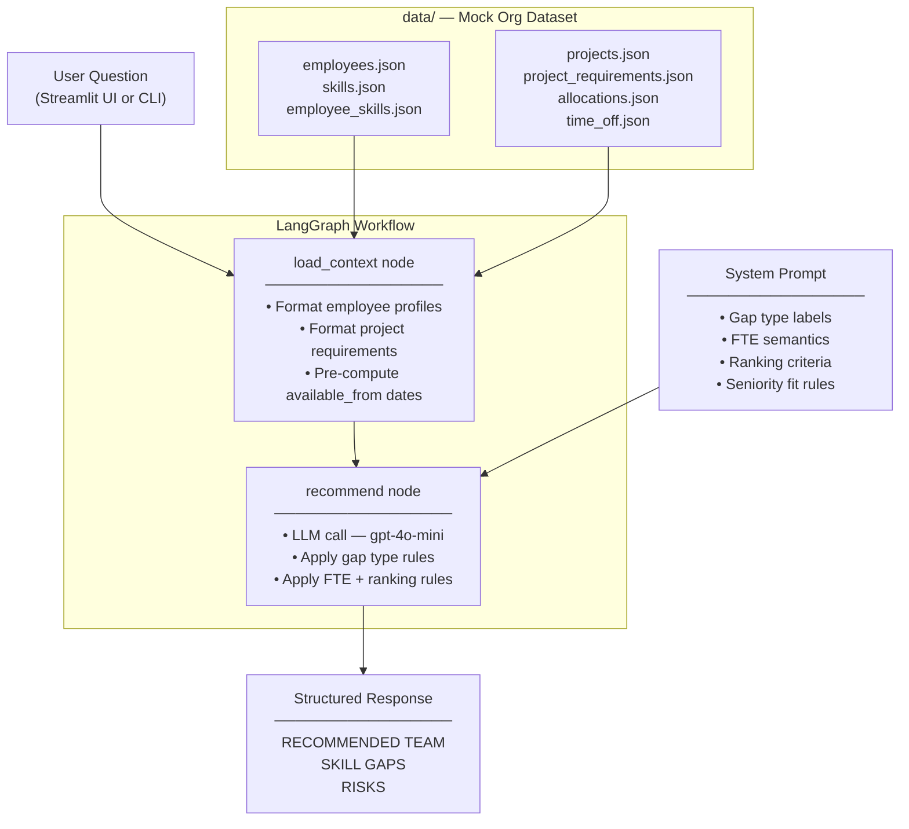

# AI Workforce Capacity Planner

An AI system that helps engineering leaders answer natural language questions about staffing, skill gaps, and resource allocation across their project pipeline.

**Target users:** VP of Engineering, team leads  
**Stack:** LangGraph · LangChain · OpenAI · Streamlit

---

## What it does

Ask questions like:
- *"Who should we assign to the Real-time Analytics Dashboard project?"*
- *"Who is currently over-allocated?"*
- *"Where are our biggest skill gaps for Q4 pipeline projects?"*
- *"Which projects are competing for the same engineers?"*

The system reasons over a mock org dataset — 12 employees, 6 projects, skill inventories, and live allocation data — and returns specific, data-backed recommendations with named candidates, proficiency scores, availability windows, and risk flags.

---

## Gap type labels

Every response classifies each required skill using one of four labels:

| Label | Meaning | Suggested action |
|---|---|---|
| `[COVERED]` | At least two qualified, available people exist | Proceed — assign best fit |
| `[AVAILABILITY GAP]` | Qualified people exist but are fully allocated or on leave | Reschedule, stagger start, or wait for commitments to end |
| `[COVERAGE RISK]` | Only one person meets the required proficiency — single point of failure | Document the dependency; add redundancy before the project goes live |
| `[TRUE SKILL GAP]` | Nobody on the team meets the required proficiency level | Hire, upskill, or bring in a contractor |

Labels are defined as constants in `prompts.py` (`GAP_LABELS`) and used by the system prompt, the UI badge colorizer, and the eval harness — one source of truth.

---

## Architecture (v0 — Context Stuffing)



---

## Setup

**1. Clone the repo**
```bash
git clone https://github.com/nilay320/workforce_capacity_planner.git
cd workforce_capacity_planner
```

**2. Create and activate a virtual environment**
```bash
uv venv .venv
source .venv/bin/activate      # macOS / Linux
# .venv\Scripts\activate       # Windows
```

**3. Install dependencies**
```bash
uv pip install -r requirements.txt
```

**4. Set up environment variables**
```bash
cp .env.example .env
# Required:       OPENAI_API_KEY
# For evals only: ARIZE_API_KEY, ARIZE_SPACE_ID
```

---

## Running locally

**Interactive CLI:**
```bash
python main.py
```

**Scoped to a specific project:**
```bash
python main.py --project P004
```

**Single question, non-interactive:**
```bash
python main.py --question "Who should we assign to P004?"
```

**Streamlit UI:**
```bash
python -m streamlit run app.py
# Opens at http://localhost:8501
```

**Live deployment:** [workforce-planner.streamlit.app](https://workforce-planner.streamlit.app)

---

## Evaluation

The `eval/` directory contains an Arize experiment harness with 10 test cases and 4 evaluators:

| Evaluator | Type | What it checks |
|---|---|---|
| `answer_relevance` | LLM judge | Does the response address the question? |
| `specificity` | LLM judge | Does it name actual people, not give generic advice? |
| `gap_label_recall` | Code-based | Are the correct gap type labels present? |
| `name_recall` | Code-based | Are the expected employee names mentioned? |

**Baseline results (v1 dataset):** answer_relevance 1.00 · specificity 1.00 · gap_label_recall 0.80 · name_recall 1.00

**Run evals** (requires `ARIZE_API_KEY` and `ARIZE_SPACE_ID` in `.env`):
```bash
# First run — creates a new Arize dataset from eval/test_cases.py
python eval/evaluate.py --dataset-name workforce-planner-eval-v1

# Re-run against the same dataset (new experiment, same rows)
python eval/evaluate.py --dataset-name workforce-planner-eval-v1 --reuse-dataset

# Changed test case expectations? Use a new dataset version
python eval/evaluate.py --dataset-name workforce-planner-eval-v2
```

When using `--reuse-dataset`, expected labels/names come from the Arize-stored rows, not the local `test_cases.py`. Use a new versioned dataset name whenever you update expectations.

---

## Project structure

```
├── app.py                  # Streamlit UI
├── planner.py              # LangGraph workflow (load_context → recommend)
├── prompts.py              # System prompt + context formatters
├── data.py                 # JSON loader + lookup helpers
├── main.py                 # CLI entry point
│
├── data/                   # Mock org dataset (edit these to change org data)
│   ├── employees.json
│   ├── skills.json
│   ├── employee_skills.json
│   ├── projects.json
│   ├── project_requirements.json
│   ├── allocations.json
│   └── time_off.json
│
├── .streamlit/
│   └── config.toml         # UI theme (colors, font)
│
├── eval/
│   ├── test_cases.py       # 10 test cases with expected labels + names
│   └── evaluate.py         # Arize experiment runner (4 evaluators)
│
├── .cursor/rules/          # Cursor AI rules (always applied in this repo)
├── requirements.txt
└── .env.example
```

---

## Mock data

The `data/` directory contains a fictional mid-size B2B SaaS engineering org:

| Entity | Count |
|---|---|
| Employees | 12 (mix of FTE and contractor) |
| Skills | 20 (technical, domain, leadership) |
| Projects | 6 (3 active, 3 pipeline) |
| Allocations | 11 active assignments |

To modify the org data, edit the JSON files directly — no Python knowledge required.

---

## Three iterations (design progression)

| Iteration | Paradigm | Description |
|---|---|---|
| v0 (current) | Context stuffing | All data loaded into LLM context, single call |
| Iteration 2 | Workflow Agent + Retrieval | ChromaDB (employee profiles) + SQLite (structured data) |
| Iteration 3 | Autonomous Agent | Goal decomposition, tool-calling loop, episodic memory |

---

## Team

Prashant Batra · Andy Ng · Sukhanya Rajan · Javed Jafar · Elaine Park · Nilay Jhaveri · Samrat Chatterjee

*Capstone project — Building Agentic AI Applications with a Problem-First Approach*
